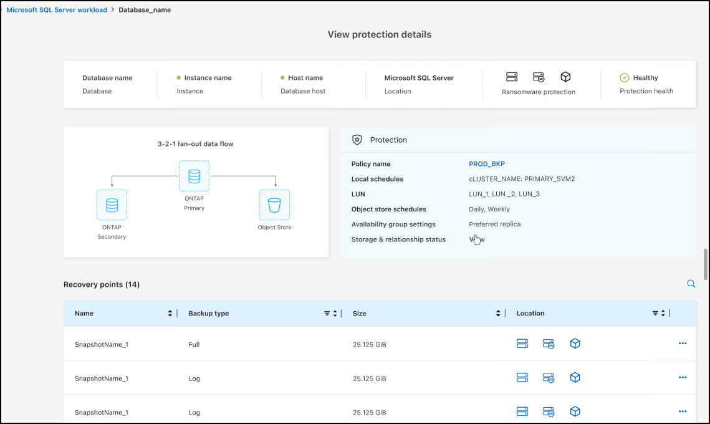
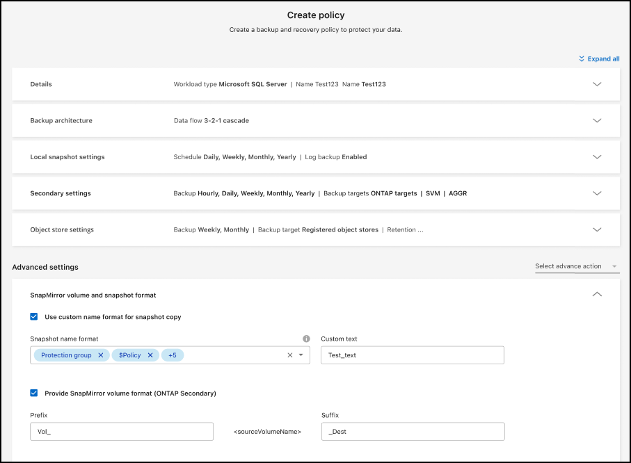
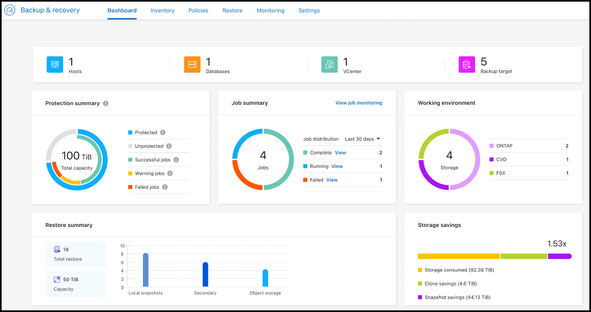

= 通用可用性 (GA) 中支援 Microsoft SQL Server 工作負載
:allow-uri-read: 

=== 通用可用性 (GA) 中支援 Microsoft SQL Server 工作負載

Microsoft SQL Server 工作負載支援現已在NetApp Backup and Recovery 中正式推出 (GA)。在ONTAP、 Cloud Volumes ONTAP和Amazon FSx for NetApp ONTAP儲存上使用 MSSQL 環境的組織現在可以利用這項新的備份和復原服務來保護他們的資料。

與先前的預覽版本相比，此版本對 Microsoft SQL Server 工作負載支援進行了以下增強：

* * SnapMirror主動同步*：此版本現在支援SnapMirror主動同步（也稱為SnapMirror業務連續性 [SM-BC]），即使整個網站發生故障，它也能使業務服務繼續運行，支援應用程式使用輔助副本透明地進行故障轉移。NetApp Backup and Recovery 現在支援在SnapMirror主動同步和 Metrocluster 配置中保護 Microsoft SQL Server 資料庫。此資訊顯示在「保護詳細資料」頁面的「儲存和關係狀態」部分。關係資訊顯示在策略頁面更新後的*輔助設定*部分。
+
參考 https://docs.netapp.com/us-en/data-services-backup-recovery/br-use-policies-create.html["使用策略保護您的工作負載"]。

+

* *多重儲存桶支援*：您現在可以保護工作環境中的捲，每個工作環境最多可跨不同的雲端供應商使用 6 個儲存桶。
* SQL Server 工作負載的*授權與免費試用更新*：您現在可以使用現有的NetApp Backup and Recovery 授權模型來保護 SQL Server 工作負載。SQL Server 工作負載沒有單獨的授權要求。
+
有關詳細信息，請參閱 https://docs.netapp.com/us-en/data-services-backup-recovery/br-start-licensing.html["設定NetApp Backup and Recovery 的許可"]。

* *自訂快照名稱*：您現在可以在管理 Microsoft SQL Server 工作負載備份的原則中使用自己的快照名稱。在策略頁面的*進階設定*部分輸入此資訊。
+

+
參考 https://docs.netapp.com/us-en/data-services-backup-recovery/br-use-policies-create.html["使用策略保護您的工作負載"]。

* *輔助卷前綴和後綴*：您可以在策略頁面的*進階設定*部分輸入自訂前綴和後綴。
* *身分和存取*：您現在可以控制使用者對功能的存取。
+
參考 https://docs.netapp.com/us-en/data-services-backup-recovery/br-start-login.html["登入NetApp備份與復原"]和 https://docs.netapp.com/us-en/data-services-backup-recovery/reference-roles.html["NetApp備份和復原功能訪問"]。

* *從物件儲存還原到備用主機*：即使主儲存已關閉，您現在可以從物件儲存還原到備用主機。
* *日誌備份資料*：資料庫保護詳細資料頁面現在顯示日誌備份。您可以看到備份類型列，顯示備份是完整備份還是日誌備份。
* *增強型儀表板*：儀表板現在顯示儲存和複製節省。
+

=== ONTAP磁碟區工作負載增強功能

* * ONTAP磁碟區的多資料夾復原*：到目前為止，您可以透過瀏覽和復原功能一次還原一個資料夾或多個檔案。NetApp Backup and Recovery 現在提供使用瀏覽和復原功能一次選擇多個資料夾的功能。
* *檢視和管理已刪除磁碟區的備份*： NetApp備份和還原儀表板現在提供顯示和管理從ONTAP中刪除的磁碟區的選項。透過此功能，您可以查看和刪除ONTAP中不再存在的磁碟區的備份。
* *強制刪除備份*：在某些極端情況下，您可能希望NetApp Backup and Recovery 不再存取備份。例如，如果服務不再有權存取備份儲存桶或備份受到 DataLock 保護但您不再需要它們，則可能會發生這種情況。以前，您無法自行刪除這些內容，而需要致電NetApp支援。在此版本中，您可以使用選項強制刪除備份（在磁碟區和工作環境層級）。

CAUTION: 請謹慎使用此選項，並且僅在極端清理需要時使用。即使這些備份未被從物件儲存中刪除， NetApp Backup and Recovery 也將無法再存取它們。您需要前往雲端提供者並手動刪除備份。

參考 https://docs.netapp.com/us-en/data-services-backup-recovery/prev-ontap-protect-overview.html["保護ONTAP工作負載"]。
